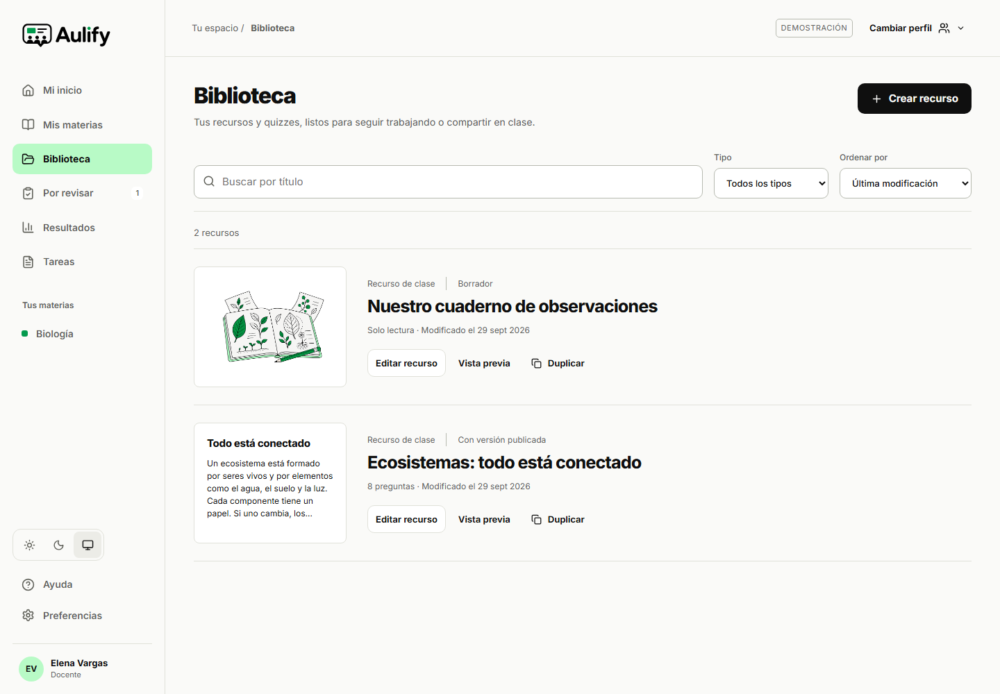
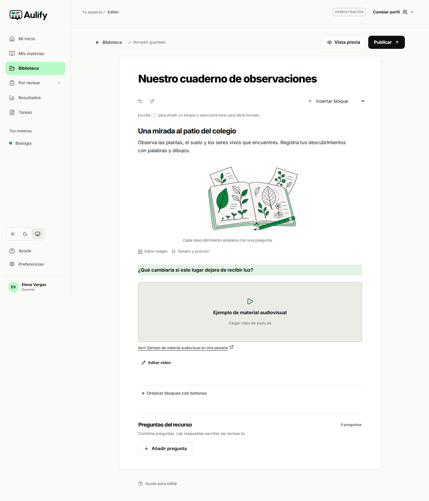
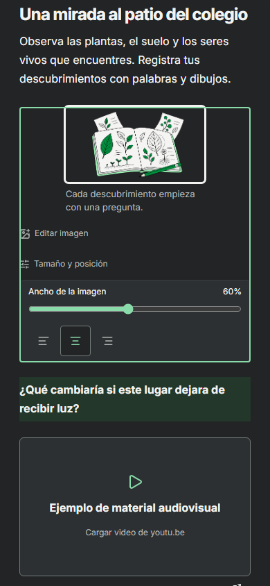
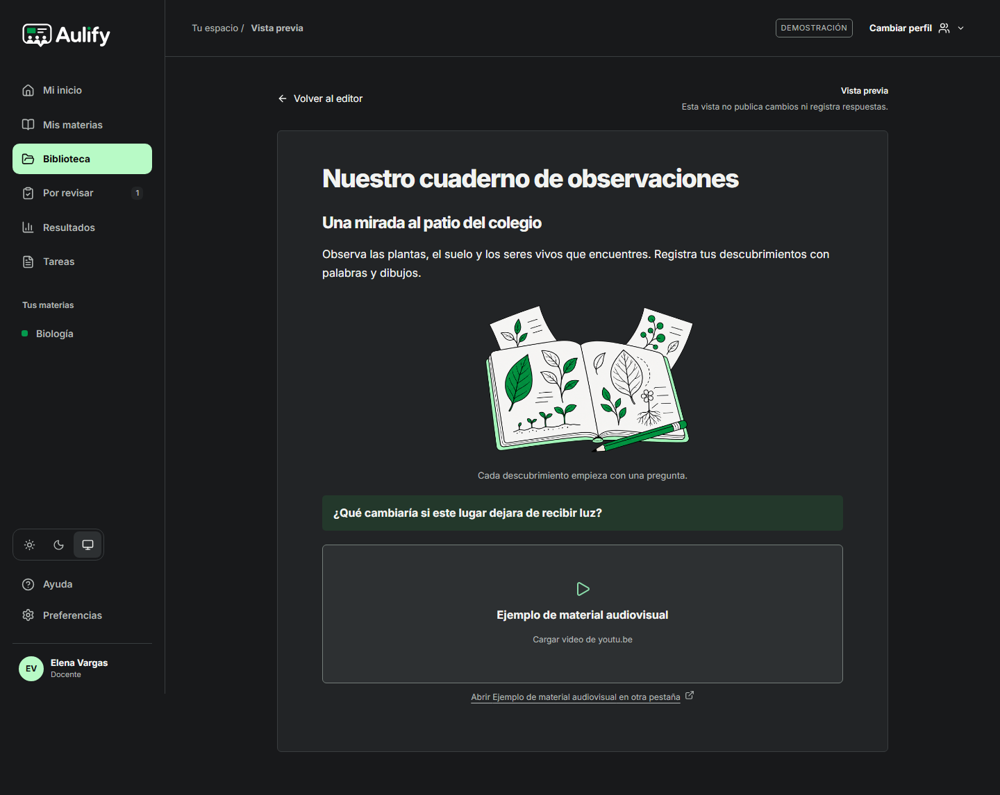

# Revisión de biblioteca, editor y lectura

Fecha: 29 de septiembre de 2026. Código: `348c136` y `e13afb4`. Compilación de las capturas: `uZBQUp2oMTlvRbKzF6icy`.

## Cambios observables

- La biblioteca muestra texto, imágenes o la primera pregunta del recurso. Permite buscar, filtrar, ordenar por título o modificación y crear copias independientes. Ya no repite una portada decorativa para contenidos distintos.
- En móvil, la navegación abre un diálogo que mantiene el foco dentro, se cierra con Escape o con su botón y devuelve el foco al control de apertura. Las materias y preferencias siguen disponibles con poca altura de pantalla.
- La imagen mantiene su proporción, texto alternativo y pie. Su ancho y alineación se ajustan mediante arrastre o controles de teclado; el borrador y el lector conservan estos valores.
- El editor y el lector comparten colores semánticos de texto y fondo para ambos temas. Se conservan alineación, listas, tablas y desplegables, con una hoja de lectura centrada y acciones compactas.
- El video reconocido se carga tras una acción explícita, sin reproducción automática, y conserva el enlace original. YouTube utiliza su dominio de privacidad mejorada; otros enlaces HTTPS permanecen accesibles como enlaces si no tienen un reproductor reconocido. Los parámetros y el dominio se basan en la [documentación del reproductor](https://developers.google.com/youtube/player_parameters) y la [ayuda de inserción](https://support.google.com/youtube/answer/171780?hl=en).

## Verificación

| Comprobación | Resultado y alcance |
|---|---|
| Vitest | 48 pruebas aprobadas en 9 archivos. |
| Construcción, tipos, ESLint y formato | Correctos en el árbol de esta revisión. |
| Playwright público | 66 aprobados y 2 fallidos en el lote inicial; se corrigió el selector que intentaba enfocar el texto interior de un desplegable y ambos casos pasaron al repetirse. Total de escenarios públicos comprobados: 68. |
| Playwright autenticado | 22 omitidos en este lote, sin habilitar credenciales. No se cuentan como aprobados ni sustituyen los informes remotos anteriores. |
| Imagen | Cuatro ejecuciones comprueban persistencia, proporción, alineación, teclado, lector y compatibilidad del documento anterior; el arrastre se comprueba en escritorio. |
| Video | Dos ejecuciones comprueban inserción, guardado, carga explícita, título y enlace alternativo. La respuesta del proveedor está simulada: no certifica reproducción de contenido externo real. |
| Capturas | 18 vistas en escritorio de 1440 px y móvil emulado de 390 px, en temas claro y oscuro. Ninguna presentó desbordamiento horizontal en la captura. |

El lote general utilizó la compilación `wq8OuG8ga9i5m6gzVi2b9`. La compilación final de capturas añade únicamente el ajuste visual del contorno de selección de bloques; también compiló correctamente. La verificación de navegación, biblioteca, lectura, paleta e imágenes está implementada en `tests/e2e`. Los informes de Playwright se generan localmente y pueden contener rutas del equipo; aquí se conserva el resumen del alcance sin publicar datos de acceso.

GitHub Actions aprobó la revisión `e13afb4` en la [ejecución 36638120416](https://github.com/CubeFreaKLab/aulify/actions/runs/36638120416). Se comprobó la finalización de sus pasos, incluidos construcción y navegador. Los recuentos de la tabla anterior corresponden al ensayo local descrito y no se presentan como una transcripción del artefacto remoto.

## Evidencia visual

El [manifiesto](capturas/biblioteca-editor-2026-09-29/manifest.json) identifica ruta, tamaño, tema y compilación. Son capturas de la aplicación local con datos ficticios, no resultados de una evaluación con personas.

## Límites

No se ha medido satisfacción de usuarios ni verificado el teclado de un teléfono físico. Las comprobaciones automáticas de contraste y axe cubren estados concretos y no equivalen a conformidad completa con WCAG. El contenido con colores arbitrarios pegados puede necesitar corrección por su autor; la comprobación de contraste corresponde a la paleta de Aulify. Esta revisión no acredita SMTP, despliegue, carga ni aceptación del diseño completo.
