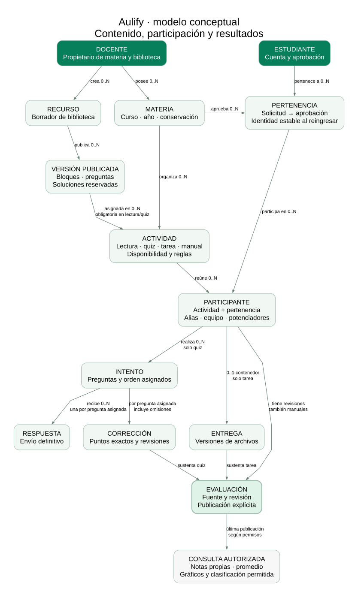

# Modelo de Aulify

Versión 1.3 · 29 de septiembre de 2026 · Basado en la especificación funcional 1.0.

El modelo describe cómo organizar y conservar la información del producto completo. Incluye **44 relaciones de dominio, tres relaciones técnicas para limitar intentos de código y sincronizar actividades y la identidad externa de Supabase Auth**. La división responde a versiones, permisos e historial: una tabla única de recursos o resultados mezclaría datos que cambian y se publican en momentos distintos.

El modelo lógico está acompañado por [migraciones SQL](../../supabase/migrations), contratos de servidor y pruebas en PostgreSQL aislado. Diecisiete migraciones están aplicadas en el proyecto de Aulify. La decimosexta separa el contador docente por participante y cuenta con verificación local y una regresión remota acotada de privacidad y sincronización. El [informe de esta revisión](../verificacion/datos-revision-participante.md) distingue su alcance de las pruebas anteriores de Auth, permisos, Storage y sincronización. El envío de correo, la capacidad y el despliegue conservan sus verificaciones pendientes.

## Cómo recorrerlo

1. [Explicación conceptual](conceptual.md): entidades, cardinalidades y decisiones principales.
2. [Casos de uso y operaciones](casos-y-operaciones.md): actores, recorridos y límites transaccionales.
3. [Modelo editable DBML](aulify.dbml): relaciones, campos, claves primarias, unicidad y claves foráneas.
4. [Diccionario](diccionario.md): propósito y significado de cada campo; tipos y nulabilidad.
5. [Normalización](normalizacion.md): dependencias, descomposición y excepciones justificadas.
6. [Restricciones](restricciones.md): reglas que las claves simples no garantizan y diseño de índices.
7. [Permisos y conservación](permisos.md): qué puede hacer cada rol y cómo evitar exposición de datos.
8. [Verificación del modelo](verificacion.md): comprobaciones realizadas y pruebas de implementación pendientes.



## Diagramas por área

Cada figura relacional muestra las claves y relaciones principales del área. El diccionario y DBML contienen todos sus atributos. Verde identifica relaciones del módulo y gris referencias a otro módulo. `1`, `0..1` y `0..N` expresan cardinalidades estructurales; por ejemplo, toda respuesta corresponde a una pregunta asignada y esa pregunta puede no tener respuesta. Las restricciones adicionales de publicación están en el documento de restricciones.

| Área | Figura legible | Fuente editable |
|---|---|---|
| Vista conceptual | [SVG](diagramas/00-conceptual.svg) · [PNG](diagramas/00-conceptual.png) | [DOT](diagramas/00-conceptual.dot) |
| Identidad y pertenencia | [SVG](diagramas/01-identidad.svg) · [PNG](diagramas/01-identidad.png) | [DOT](diagramas/01-identidad.dot) |
| Autoría y contenido | [SVG](diagramas/02-autoria.svg) · [PNG](diagramas/02-autoria.png) | [DOT](diagramas/02-autoria.dot) |
| Actividades y disponibilidad | [SVG](diagramas/03-actividades.svg) · [PNG](diagramas/03-actividades.png) | [DOT](diagramas/03-actividades.dot) |
| Participación y juego | [SVG](diagramas/04-participacion.svg) · [PNG](diagramas/04-participacion.png) | [DOT](diagramas/04-participacion.dot) |
| Entregas y evaluación | [SVG](diagramas/05-evaluacion.svg) · [PNG](diagramas/05-evaluacion.png) | [DOT](diagramas/05-evaluacion.dot) |
| Integridad y conservación | [SVG](diagramas/06-operacion.svg) · [PNG](diagramas/06-operacion.png) | [DOT](diagramas/06-operacion.dot) |
| Casos de uso | [SVG](diagramas/07-casos-de-uso.svg) · [PNG](diagramas/07-casos-de-uso.png) | [DOT](diagramas/07-casos-de-uso.dot) |
| Estados independientes | [SVG](diagramas/08-estados.svg) · [PNG](diagramas/08-estados.png) | [DOT](diagramas/08-estados.dot) |
| Confirmación de respuesta | [SVG](diagramas/09-respuesta.svg) · [PNG](diagramas/09-respuesta.png) | [DOT](diagramas/09-respuesta.dot) |

Los SVG permiten ampliar sin perder nitidez; los PNG sirven para insertar figuras. Las imágenes son exportaciones del modelo, no capturas de una aplicación funcionando.

## Fuente y reproducción

[modelo.json](modelo.json) es la fuente de campos, claves, referencias y reglas. El [generador](../../tools/modelado/generar.py) produce DBML, diccionario y los seis diagramas relacionales. Los diagramas conceptual, de uso, estados y respuesta se mantienen como DOT editables. Para cambiar una relación, modificar primero JSON y regenerar; no editar únicamente la imagen.

Desde la raíz del repositorio, con Python 3 y Graphviz disponibles:

```powershell
python tools/modelado/generar.py
python tools/modelado/generar.py --check
```

El segundo comando valida claves, tipos, referencias a reglas y coherencia de archivos derivados sin conectar servicios. Las claves foráneas de borrado describen el destino final de datos, no autorizan borrar versiones, notas o archivos desde el navegador.

## Construcción por entregas

Para 001 se necesitan identidad/pertenencia, recurso y borrador, versiones, selección simple/abierta, actividades individuales, intentos/respuestas, corrección, publicación y ayuda. Equipos, potenciadores, archivos de tareas, modo guiado, incidencias y purga se incorporan en entregas posteriores conforme a [las tareas](../../tasks.md).

La implementación física añade descripción de materia, documento de presentación publicado, nota de entrega y metadatos de reserva/purga de archivos. `join_request_checks` conserva solo cuenta y hora para limitar también códigos inválidos; se depura a los diez minutos. El [contrato](../../supabase/CONTRACT.md) define comandos y proyecciones, y el [ADR inicial](../decisiones/0003-modelo-relacional.md) conserva la justificación de la base relacional.

La revisión 1.2 incorpora `activity_sync_versions` y `participant_sync_versions`: contadores derivados actualizados al confirmar transacciones. No contienen respuestas, calificaciones ni decisiones de acceso. Mantienen las 44 relaciones del dominio y elevan a 47 el total de tablas propias.

La revisión 1.3 añade `participant_sync_versions.teacher_revision`. Las respuestas y correcciones personales actualizan la fila de ese participante. La huella docente combina la marca común y un agregado estable de identidades y revisiones; los cambios privados siguen fuera de la huella estudiantil. El total de relaciones se conserva. Esta modificación evita la escritura de una fila común en ese recorrido; no demuestra por sí sola la capacidad remota requerida.
