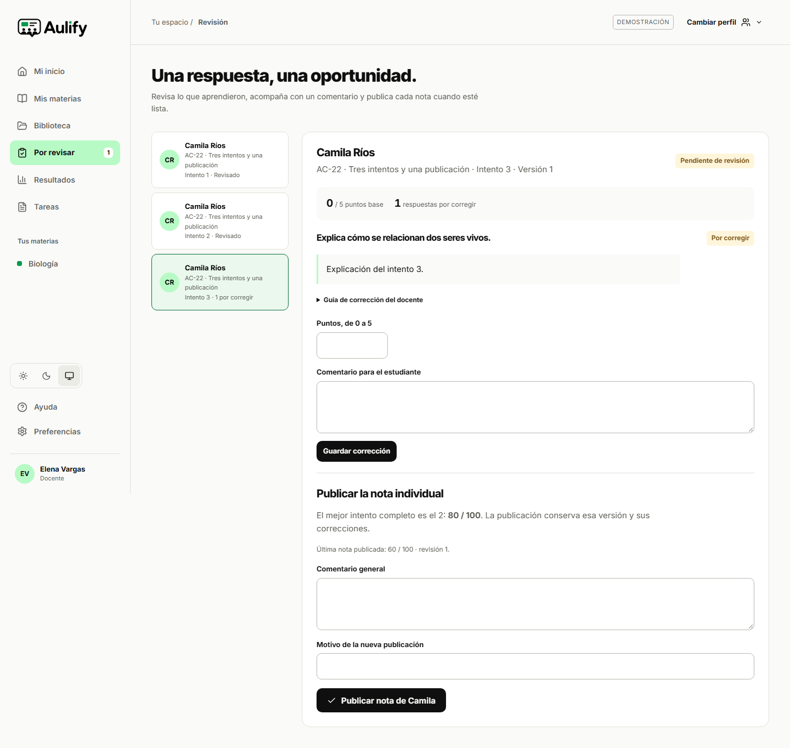

# Aceptación de notas pendientes y cero por ausencia en un quiz

29 de septiembre de 2026. Se verificaron las brechas concretas de AC-22 y AC-38 sin modificar el producto ni los criterios de aceptación. Datos ficticios: Camila, Elena y dos identidades de una base aislada.

| Caso | Entorno | Resultado observado |
|---|---|---|
| AC-22 · Indicación de revisión pendiente | Next.js en desarrollo, webpack, `127.0.0.1:3002`; demostración local; Chromium a 1440 × 900 y 390 × 844 | Dos ejecuciones aprobadas, 20,6 s. El tercer intento conserva «1 por corregir» y «Pendiente de revisión»; la misma vista muestra el segundo intento como mejor candidato, 80/100, y la publicación anterior de 60/100. |
| AC-38 · Cero explícito en quiz no iniciado | PGlite 0.5.8, dieciséis migraciones del repositorio, contrato público con rol `authenticated` | Una prueba aprobada, 2,42 s de ejecución total. No hay intento ni cero automático; se exige una decisión docente con motivo, se publica cero y se incluye en el promedio. |
| Comprobaciones estáticas | Node.js 24.14.1, Windows; archivos nuevos | ESLint, TypeScript sin emisión, formato y comprobación del diff aprobados. |

Las dos ejecuciones de AC-22 corresponden al mismo escenario en dos tamaños. AC-38 contiene varias aserciones de una sola secuencia, no nuevos casos por cada comprobación. Los cambios de prueba estaban sin commit; las huellas siguientes identifican los archivos ejecutados. No se ejecutó ningún recorrido contra el servidor de producción local del puerto 3001 ni se envió tráfico a Supabase remoto.

## AC-22: candidato y pendiente visibles

La [prueba de navegador](../../tests/e2e/aceptacion-calificaciones.spec.ts) prepara tres intentos mediante las operaciones del dominio: 60 corregido y publicado, 80 corregido sin publicar y una respuesta escrita pendiente. Primero comprueba que el estudiante ve 60. En revisión docente selecciona el tercer intento y contrasta simultáneamente el estado pendiente, el candidato 80 y la publicación 60.

La republicación se realiza desde la interfaz con motivo. El historial queda en 60 y 80; la nueva evaluación corresponde al segundo intento. El tercero continúa sin revisión, con su aviso visible. Cambiar al estudiante y recargar conserva 80. Se comprobó ausencia de desbordamiento horizontal en los estados de revisión y resultados.



[Captura móvil completa](capturas/ac22-2026-09-29/movil.png). Las capturas se inspeccionaron visualmente; documentan esa composición y no equivalen a una evaluación con personas.

## AC-38: decisión de cero sin inventar participación

La [prueba de contrato](../../tests/unit/quiz-no-participacion.test.ts) inicia una base nueva, aplica las migraciones y crea docente, estudiante y membresía ficticios. La lógica del producto se invoca mediante `aulify_command` y `aulify_snapshot`; no se insertan evaluaciones ni intentos directamente.

Se publica un quiz respondido con 100/100 como control. Otro quiz ya cerrado permanece sin iniciar: no tiene intento ni evaluación y el promedio sigue en 100. Se rechaza registrar la ausencia desde el estudiante y también publicar cero desde el docente sin motivo. Esos rechazos conservan el estado sin evaluación.

El docente publica cero con un motivo explícito. La proyección estudiantil contiene la nota publicada y el motivo, sigue sin intento para ese quiz y el promedio pasa a 50 al incluir ambas actividades con el mismo peso. La evaluación del quiz respondido conserva su intento; la del no iniciado no lo tiene. Una consulta administrativa final de solo lectura confirma `source_kind = nonparticipation`, `attempt_id = null` y ausencia de versión de entrega. Así se distingue la decisión de ausencia de un intento respondido con cero.

La demostración deshabilita intencionalmente esta gestión y el adaptador local no implementa su comando. Por eso este caso se ejecuta contra el SQL real en PGlite, no mediante un botón simulado. No demuestra el recorrido del cero en un quiz desde navegador autenticado ni su comportamiento con Auth/JWT remotos.

## Reproducción y versión

```powershell
npx vitest run tests/unit/quiz-no-participacion.test.ts --reporter=verbose
$env:PLAYWRIGHT_BASE_URL='http://127.0.0.1:3002'
npx playwright test tests/e2e/aceptacion-calificaciones.spec.ts --workers=1 --output .local-private/ac22-38-tests --reporter=list
```

El entorno descrito requiere el servidor de desarrollo ya disponible en 3002. Vitest comenzó a las 18:57:59 de America/La_Paz (22:57:59 UTC). Los recorridos de navegador se ejecutaron inmediatamente después. Las fuentes ejecutadas tienen estos SHA-256:

| Archivo | SHA-256 |
|---|---|
| `tests/e2e/aceptacion-calificaciones.spec.ts` | `5f2875ef7fe4527d86f5484ca86401654ff8fc7b52336b8431b0a81689f7925b` |
| `tests/unit/quiz-no-participacion.test.ts` | `59c9af92700471c91d252e73142bf3f9963b3ef204b0d19d33ab89f5f4a74806` |

Esta evidencia permite actualizar AC-22 como probado en navegador local de demostración y AC-38 como probado en contrato SQL aislado. No cambia la cobertura de otros casos ni acredita persistencia remota de estos escenarios, SMTP, capacidad, accesibilidad manual o despliegue.
