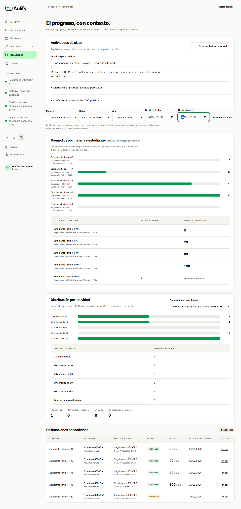


# Seguimiento: distribución y filtros de AP-26

El 28 de septiembre de 2026 se completó el recorrido definido en AP-26 con cinco estudiantes ficticios y dos materias. La pantalla incorporó filtros de fechas y distribución por actividad, que no estaban presentes en la versión anterior. Se conserva por separado la [corrección de filas duplicadas](resultados-filtros.md).

El rango incluye ambos extremos. En quizzes y tareas se usa el día del cierre; en actividades manuales, el de realización. El día del quiz respeta la zona horaria configurada. Cuando se filtran fechas, el promedio se identifica como «Promedio del intervalo» y mantiene los pesos de las notas publicadas de cada materia.

La distribución se muestra solo al docente, por actividad y sobre 100. Utiliza los intervalos [0,20), [20,40), [40,60), [60,80) y [80,100]. Los registros pendientes de corrección, corregidos sin publicar, en curso y sin participación se cuentan aparte. Una actividad manual sin evaluar aparece pendiente, con «—» en la nota; no se inventa una entrega o una calificación cero.

## Datos y resultados observados

| Comprobación                                                        | Esperado                                                                | Observado                                                              |
| ------------------------------------------------------------------- | ----------------------------------------------------------------------- | ---------------------------------------------------------------------- |
| Actividad del 25/09: notas publicadas 0, 20, 80, 100 y un pendiente | Intervalos: 1, 1, 0, 0, 2; cuatro publicadas y un pendiente             | Coincide en escritorio y móvil.                                        |
| Valor 100                                                           | Incluido en el último intervalo                                         | Coincide.                                                              |
| Tabla y gráfico de distribución                                     | Mismos cinco recuentos; longitudes de barras proporcionales             | Coincide.                                                              |
| Rango 25/09–25/09                                                   | Cinco filas; promedios individuales 0, 20, 80, 100 y sin nota publicada | Coincide; el pendiente no añade un cero.                               |
| Añadir actividad del 26/09, nota 40 para los cinco                  | Diez filas; promedios 20, 30, 60, 70 y 40                               | Coincide; ambas actividades tienen peso 1.                             |
| Rango 26/09–26/09                                                   | Cinco filas; solo la segunda actividad; distribución 0, 0, 5, 0, 0      | Coincide; el selector descarta la actividad que queda fuera del rango. |
| Segunda materia, nota 10                                            | Promedio propio 10, independiente de la primera materia                 | Coincide.                                                              |
| Filtros de curso y año                                              | Solo materias del grupo/año indicado; combinación incompatible vacía    | Coincide; restablecer devuelve los valores iniciales.                  |
| Estudiante con 0 en una materia y 10 en otra                        | Dos promedios separados y sin distribución de compañeros                | Coincide.                                                              |
| Equivalencia del promedio                                           | Valores de tabla iguales a los del gráfico en cada intervalo probado    | Coincide.                                                              |

Los valores se publicaron mediante las operaciones reales de la aplicación contra Supabase. Las materias creadas para la prueba se archivaron al terminar. No se utilizaron estudiantes reales ni se alteraron sus datos.

## Ejecución y evidencia

El [caso AP-26](../../tests/e2e/resultados-integrados.spec.ts) y la regresión de duplicados se ejecutaron en Chromium a 1440 × 900 y en móvil emulado a 390 × 844: **cuatro ejecuciones aprobadas, sin omisiones ni fallos**. Inicio: 2026-09-28, 08:42:29,027 UTC; duración: 39,3 s. Compilado local `pxh1ODWREQKmVs3aCb8qm`, Supabase Free remoto. El [registro resumido](resultados-distribucion.json) conserva estos datos.

Las [tres pruebas unitarias](../../tests/unit/result-analytics.test.ts) comprueban los límites del histograma, normalización de máximos distintos sin redondear antes de clasificar, fechas inclusivas y la diferencia de día entre UTC y America/La_Paz. Aprobaron las tres. El análisis estático y de tipos también aprobó.

Dos análisis axe, uno en cada tamaño, no detectaron infracciones en las reglas WCAG A/AA seleccionadas en la vista recorrida. No hubo desbordamiento horizontal de la página. Las tablas móviles tienen desplazamiento propio. Estas comprobaciones no equivalen a una revisión manual con lector de pantalla ni a una certificación de accesibilidad.

Reproducción: utilizar el procedimiento de [resultados-filtros.md](resultados-filtros.md), con cinco estudiantes ficticios preparados en el pool local del entorno de pruebas. El ejecutor no recibe credenciales desde Git y desactiva trazas y vídeo. Esta ejecución cierra el escenario AP-26 descrito, no todos los requisitos de seguimiento, usabilidad o rendimiento.
