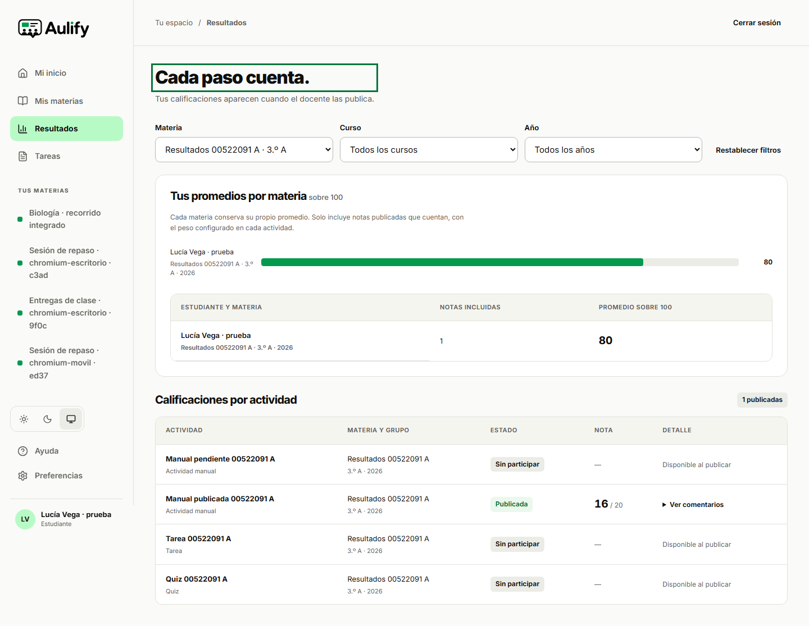
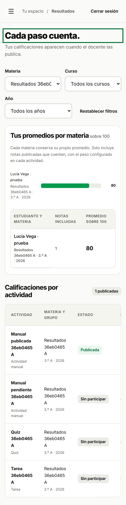

# Regresión del filtro de resultados

El 28 de septiembre de 2026 se reprodujo un defecto de la vista estudiantil de resultados. Al seleccionar una materia con cuatro actividades, la tabla conservaba 27 filas. La respuesta del servidor estaba separada por materia; el problema se encontraba en la composición de la interfaz.

`student_results` devuelve quizzes, tareas y actividades manuales. La vista trataba todos esos elementos como quizzes y añadía otra vez las tareas y las actividades manuales publicadas. Esto producía claves repetidas de actividad/estudiante. Al actualizar el filtro, React podía conservar filas que ya no correspondían a la selección.

La corrección utiliza una sola vez la proyección remota estudiantil y obtiene el tipo de actividad de los datos del aula. Conserva las actividades manuales pendientes, sin inventarles una nota. La vista docente y la composición del repositorio de demostración mantienen sus fuentes existentes.

## Comprobación

El [caso reproducible](../../tests/e2e/resultados-integrados.spec.ts) crea dos materias ficticias. Cada una contiene un quiz, una tarea, una actividad manual con nota publicada y otra manual sin evaluar. Las operaciones usan cuentas ficticias y Supabase remoto, a través de los endpoints de la aplicación.

| Ejecución           | Entorno                           | Resultado                                                                               |
| ------------------- | --------------------------------- | --------------------------------------------------------------------------------------- |
| Antes de corregir   | Chromium escritorio, 1440 × 900   | Fallo reproducido: cuatro filas esperadas y 27 observadas tras seleccionar una materia. |
| Después de corregir | Chromium escritorio, 1440 × 900   | Aprobado.                                                                               |
| Después de corregir | Chromium móvil emulado, 390 × 844 | Aprobado.                                                                               |

La verificación posterior alterna A/B/A/B, exige cuatro filas en cada selección y comprueba que cada actividad aparece una sola vez, con el tipo y la materia correctos. La actividad manual sin evaluar conserva su estado y muestra «—» en la nota. Al volver a todas las materias, cada una de las ocho actividades sigue apareciendo una sola vez. No se registraron advertencias de claves repetidas y no se detectó desbordamiento horizontal de la página. La tabla móvil mantiene desplazamiento horizontal propio para consultar todas sus columnas.

La ejecución posterior comenzó a las 08:30:02,817 UTC y terminó sin fallos ni omisiones, en 21,4 segundos. Se utilizó la aplicación compilada localmente con identificador `7Q51XhoTLuizcaUW7mZnR`, conectada a Supabase Free. El [registro resumido](resultados-filtros.json) conserva el resultado anterior y posterior. Los resultados completos y las credenciales se mantienen fuera de Git; las capturas siguientes contienen datos ficticios.





## Reproducción y límites

Con el entorno de prueba autorizado y las cuentas locales preparadas:

```powershell
$env:AULIFY_REMOTE_E2E='1'
$env:PLAYWRIGHT_BASE_URL='http://127.0.0.1:3002'
npx playwright test tests/e2e/resultados-integrados.spec.ts --workers=1
```

El ejecutor archiva las materias ficticias creadas al terminar. No elimina datos existentes. Las trazas, vídeo y captura automática de fallos están desactivados; las capturas finales se toman después de acceder a la vista de resultados.

Esta regresión verifica la unicidad y el filtro por materia. No cierra todo AP-26: quedan los valores frontera de distribución 0, 20, 80 y 100, los filtros restantes y la equivalencia de todos los intervalos entre tabla y gráfico. Tampoco es una prueba de capacidad, una revisión con lector de pantalla ni una comprobación en un teléfono físico.
