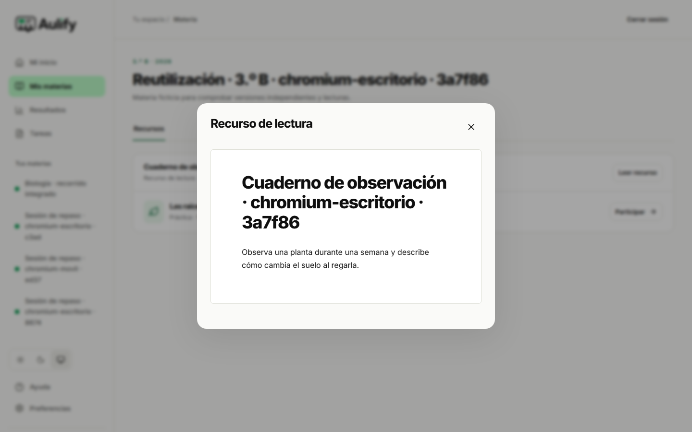
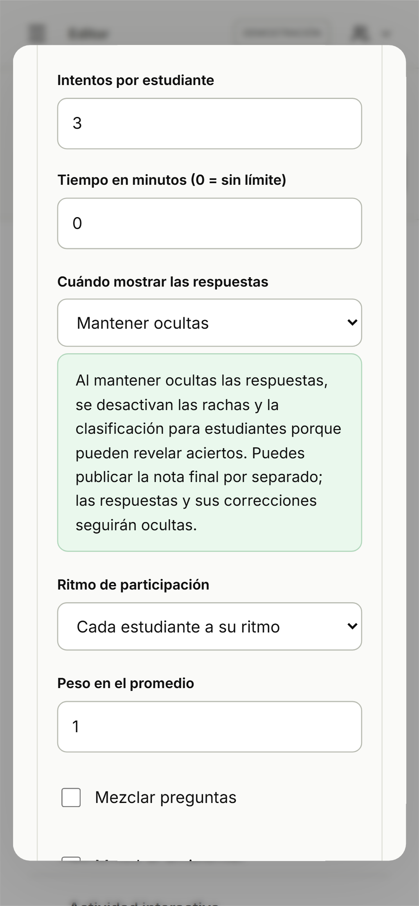

# Reutilización entre materias y configuración comprensible

Verificación del 30 de septiembre de 2026. Los criterios [AP-01, AP-02 y AP-15](../../specs/aceptacion-producto.md) se contrastaron en Chromium de escritorio y móvil emulado. Los [resultados y huellas de archivos](reutilizacion-y-configuracion.json) identifican el compilado local, las ejecuciones y sus capturas.

## Reutilizar conservando el trabajo anterior

El recorrido de [reutilización integrada](../../tests/e2e/reutilizacion-integrada.spec.ts) crea dos materias ficticias con estudiantes distintos. Primero, E1 responde un quiz de la materia A y recibe una nota publicada de 20/20. Desde la biblioteca, el docente duplica ese recurso, modifica el título, el enunciado y el valor de la pregunta, y publica la copia en la materia B con máximo de 30 y un intento.

Las comprobaciones comparan el contenido original, la versión utilizada, la respuesta y la evaluación antes y después de la copia: permanecen iguales. B comienza sin integrantes, intentos ni notas. E2 ingresa mediante código y aprobación; E1 no recibe acceso a B y E2 no recibe acceso a A. La copia conserva su propio identificador y versión.

E2 responde la copia y obtiene 30/30. Un segundo intento se rechaza y el recuento permanece en uno. El original conserva su nota 20/20 y su historia. La comprobación de contenido también confirma que la copia contiene el nuevo enunciado y cuatro puntos, mientras el original conserva los dos puntos anteriores.

## Lectura sin evaluación

En la misma ejecución, el docente publica en B un recurso con texto y sin preguntas. El diálogo informa que se compartirá como lectura y no muestra el campo de nota máxima. E2 abre «Leer recurso» y consulta el contenido sin un botón para responder ni comenzar un intento.

Las proyecciones anteriores y posteriores a esa consulta conservan los mismos intentos y evaluaciones. La única actividad evaluada de B es el quiz independiente. Así se comprueban juntos la lectura sin nota y el quiz con su propia configuración.



## Explicación del ocultamiento

El [recorrido de configuración](../../tests/e2e/retroalimentacion-config.spec.ts) usa la demostración local. Activa rachas y clasificación y después selecciona mantener ocultas las respuestas. Ambas opciones se desmarcan y deshabilitan; una explicación visible indica que podrían revelar aciertos y que la nota final puede publicarse por separado sin revelar respuestas ni correcciones.

El mensaje se asocia al selector y a los controles mediante su descripción accesible y anuncia sus cambios. Al volver a la corrección inmediata, los controles vuelven a estar disponibles, pero no se activan sin intervención. La prueba comprueba las descripciones, la ausencia de desbordamiento horizontal y el cierre con Escape. No sustituye una sesión manual con lector de pantalla. La reserva de datos y la nota publicada tienen su evidencia remota previa en E03, E04 y E07 de la [matriz](../calidad/trazabilidad.md).



## Alcance y reproducción

Son dos escenarios, repetidos en dos tamaños: cuatro ejecuciones aprobadas, sin omitidos ni reintentos. Los controles de tipos y compilación, ESLint y formato se comprobaron por separado. El primer ensayo también aprobó; se ajustaron las capturas para esperar el editor cargado y mostrar la explicación, y se corrigió el singular «1 pregunta». La repetición no se cuenta como nuevos escenarios.

AP-01/AP-02 utilizan la aplicación compilada local y Supabase real. El docente se ejecuta con los perfiles de escritorio y móvil de Playwright; los estudiantes usan contextos separados con anchos de 1440 y 390 píxeles. Acceso, preparación, aprobación de integrantes, publicación de notas y comparaciones de estado se realizan mediante la API autenticada. Duplicación, edición, publicación de recursos, lectura y respuestas se ejecutan por la interfaz. No se crearon cuentas nuevas: se usaron las cuentas ficticias reservadas para pruebas. Las cuatro materias de la ejecución final quedaron archivadas y las seis sesiones se cerraron individualmente.

Con las cuentas ficticias configuradas localmente, iniciar el compilado en el puerto 3001 y ejecutar:

```powershell
$env:PLAYWRIGHT_BASE_URL='http://127.0.0.1:3001'
$env:AULIFY_REMOTE_E2E='1'
npx playwright test tests/e2e/reutilizacion-integrada.spec.ts tests/e2e/retroalimentacion-config.spec.ts --workers=1
```

La prueba remota limita el destino a la aplicación local y al proyecto reservado. Sin las credenciales locales se omite en CI; la prueba de configuración puede ejecutarse allí. Estos resultados no acreditan dispositivos físicos, SMTP, capacidad, restauración operativa ni producción. La Preview desplegada conserva su revisión y evidencia propias.

El [CI 36696391140](https://github.com/CubeFreaKLab/aulify/actions/runs/36696391140) aprobó la revisión `4cbdca3`: 162 pruebas unitarias y 90 recorridos de navegador, sin casos inestables. Se omiten 30 ejecuciones autenticadas; AP-01/AP-02 conservan su evidencia local con Supabase descrita arriba. La prueba de explicación de AP-15 sí se ejecutó en CI. Los conteos de SQL y las huellas de logs descargados están en el [registro](ci-integracion.json).
